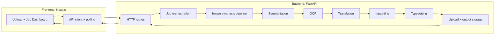

# DeepWiki Architecture

## 1. System purpose

This repository implements a local-first manga translation pipeline. The system accepts one or more manga page images, detects speech bubbles, extracts text, translates it into Thai, removes the original text from the artwork, and renders the translated dialogue back into the page for review and export.

The architecture is intentionally split into a Python backend that performs the image and model processing, and a Next.js frontend that manages uploads, status polling, and result inspection.

## 2. High-level architecture

## 3. Request lifecycle

### 3.1 Upload

1. The user selects one or many image files in the frontend.
2. The frontend sends the files to `POST /api/translate`.
3. The backend validates the request, stores the uploads, and creates a job record.
4. The API returns a job identifier immediately so the UI can begin polling.

### 3.2 Processing

The backend runs the pipeline asynchronously or in a background execution path. Each job moves through the same core stages:

- segmentation
- OCR
- translation
- inpainting
- typesetting
- result packaging

### 3.3 Progress reporting

The frontend polls `GET /api/status/{job_id}`.
The backend returns the current stage, progress, errors if any, and URLs for the original, cleaned, and final outputs.

### 3.4 Review

The UI displays the results side by side so the user can compare the original page with cleaned and translated outputs.

## 4. Backend architecture

### 4.1 Entry point and HTTP layer

The backend is centered around `backend/main.py`, which exposes the API routes and health endpoints. The HTTP layer handles:

- health checks
- translation job submission
- status lookup
- static file serving for generated artifacts

### 4.2 Job orchestration

Jobs represent the unit of work for a single uploaded image or batch. A job tracks:

- input file metadata
- pipeline stage
- output artifact paths
- errors
- completion state

This orchestration layer keeps the HTTP API thin and delegates work to the synthesis pipeline.

### 4.3 Synthesis pipeline

The synthesis pipeline lives under `backend/synthesis/` and is responsible for the actual manga-processing workflow.

#### Segmentation

`backend/synthesis/segmentation.py` detects or prepares the regions that contain speech bubbles or text.

Responsibilities:

- identify candidate bubble regions
- refine masks where necessary
- provide inputs for OCR and inpainting

#### Inpainting

`backend/synthesis/inpainting.py` removes original text while preserving the surrounding art.

Responsibilities:

- build or refine masks
- apply a model-based or OpenCV fallback inpaint path
- output a cleaned page image

#### Typesetting

`backend/synthesis/typesetting.py` places translated text back onto the cleaned image.

Responsibilities:

- wrap translated text to fit bubble geometry
- render text with appropriate font and spacing
- composite the result onto the page

### 4.4 Model integration

The backend integrates several model types and runtime concerns:

- detection and segmentation models for bubble localization
- OCR via a local Ollama-based model
- translation via a BYOK OpenAI-compatible endpoint
- fallback behavior when model files or providers are unavailable

### 4.5 Storage and artifacts

The backend stores source uploads and generated outputs under an `uploads/` directory. These artifacts are served back to the frontend so the UI can inspect them directly.

Typical artifact classes include:

- original page image
- cleaned page image
- final translated page image
- intermediate masks or crops when needed for debugging

## 5. Frontend architecture

### 5.1 Application role

The frontend is a thin interaction layer. It does not perform image processing locally; instead it focuses on user experience, progress visibility, and rendering the backend outputs.

### 5.2 Feature organization

The manga translator feature lives under `frontend/src/features/manga-translator/`.

Important pieces include:

- `api/mangaApi.ts` for backend communication
- `components/MangaFileItem.tsx` for rendering file/job rows
- feature-local state and polling logic for job updates

### 5.3 UI responsibilities

The frontend handles:

- drag-and-drop upload
- list rendering for queued and completed jobs
- polling and refresh of backend state
- displaying original, cleaned, and translated images
- showing errors and empty states

## 6. Data flow by stage

### 6.1 Upload to segmentation

The backend receives an image, stores it, and passes it into the segmentation stage.

### 6.2 Segmentation to OCR

The detected regions are converted into OCR inputs. The system can fall back to broader extraction when precise bubble boundaries are weak.

### 6.3 OCR to translation

The extracted text is grouped and translated with page context when available so dialogue stays consistent across bubbles.

### 6.4 Translation to inpainting

Once the text is known, the backend generates masks for removal and restores the background through inpainting.

### 6.5 Inpainting to typesetting

The translated text is rendered using font-aware layout logic and composited back into the page.

### 6.6 Final review

The frontend exposes the outputs for review so the user can verify visual quality before export or reuse.

## 7. Dependency map

### Backend dependencies

- **FastAPI**: HTTP API and request routing
- **Uvicorn**: local server runtime
- **OpenCV**: image manipulation and fallback inpainting
- **NumPy**: mask and tensor math
- **Pillow**: text rendering and compositing
- **PyTorch**: model runtime
- **Ultralytics**: detection and segmentation model integration
- **httpx**: external API calls
- **Pydantic**: structured request and job data

### Frontend dependencies

- **Next.js**: application shell and routing
- **React**: UI composition
- **TypeScript**: typed data contracts
- **Tailwind CSS**: styling
- **Framer Motion**: motion and transitions
- **Axios**: backend requests

## 8. Model and asset layout

The repository expects several local assets that affect runtime behavior:

- OCR model assets managed through Ollama
- detection and segmentation weights such as YOLO or SAM checkpoints
- Thai fonts used by the typesetting stage

These assets are part of the runtime contract, not just optional extras, because the backend can switch between primary and fallback behavior depending on what is installed.

## 9. Failure handling and fallbacks

The design favors graceful degradation over hard failure.

Examples:

- if bubble detection is weak, the pipeline can still attempt broader OCR or fallback cleanup
- if an advanced inpainting dependency is unavailable, OpenCV fallback can still restore the page
- if translation credentials are missing, the system can fall back to a configured default behavior rather than stopping the whole flow
- if the frontend cannot resolve a relative URL, it should normalize the backend artifact path before rendering

## 10. Operational concerns

### 10.1 Performance

The backend explicitly manages heavy workloads because segmentation, OCR, and inpainting can be expensive. Model unloading and stage separation matter for VRAM control.

### 10.2 Durability

The current workflow should be treated as a job pipeline with artifact retention. If job records are in memory, persistence becomes a known limitation that should be documented or improved.

### 10.3 Observability

A production-ready version should log each stage independently so failures can be traced to segmentation, OCR, translation, inpainting, or typesetting.

## 11. Repository map

### Core files

- `README.md` — product and setup overview
- `TODO.md` — implementation backlog and hardening checklist
- `ARCHITECTURE.md` — system architecture reference
- `backend/main.py` — API entry point and job routing
- `backend/synthesis/segmentation.py` — segmentation pipeline
- `backend/synthesis/inpainting.py` — text removal and cleanup
- `backend/synthesis/typesetting.py` — translated text rendering
- `backend/tests/test_synthesis_regressions.py` — regression coverage
- `frontend/src/features/manga-translator/api/mangaApi.ts` — API client
- `frontend/src/features/manga-translator/components/MangaFileItem.tsx` — file/job row UI

## 12. Recommended deepwiki expansion areas

If this document is extended further, the next useful sections are:

1. API contract reference with request/response examples
2. job state machine and status lifecycle
3. artifact naming and URL normalization rules
4. backend stage-by-stage sequence diagrams
5. frontend component tree and state ownership
6. environment and model setup guide
7. test matrix and regression coverage map
8. failure modes and recovery playbook

## 13. Summary

This codebase is a two-layer system:

- the backend performs the translation pipeline and generates artifacts
- the frontend orchestrates uploads, polling, and review

The core architectural idea is a staged image-processing workflow with clear boundaries between detection, OCR, translation, cleanup, and rendering. That makes the project suitable for a deepwiki-style documentation pass because each stage can be documented independently while still fitting into one end-to-end user journey.
