# Architecture Deepening Review

Date: 2026-07-15

HTML report: `C:\Users\Admin\AppData\Local\Temp\architecture-review-20260715-212951.html`

## Scope

Recent commits concentrate change in `backend/main.py`, synthesis modules, translation job UI, project sessions, SSE, and regression tests. No `CONTEXT.md` or `docs/adr/` exists. Domain language below follows `ARCHITECTURE.md` and `ROADMAP.md`: translation job, project session, synthesis pipeline, human review gate, text block, translation configuration, artifact.

## Architecture vocabulary

- **Module**: behavior behind one interface.
- **Interface**: everything callers and tests must know.
- **Depth**: leverage delivered per unit of interface.
- **Seam**: location where behavior can vary without editing the caller.
- **Adapter**: concrete implementation at a seam.
- **Leverage**: capability shared across callers and tests.
- **Locality**: change, bugs, knowledge, and verification concentrated in one place.

## Candidate modules

### 1. Translation job lifecycle module

**Recommendation: Strong**

**Files**

- `backend/main.py:401-627`
- `backend/main.py:646-770`
- `backend/main.py:955-959`
- `backend/tests/test_api_response_models.py:108-152`
- `frontend/src/features/manga-translator/components/MangaTranslator.tsx:376-398`
- `frontend/src/features/manga-translator/components/MangaFileItem.tsx:16-87`
- `frontend/src/features/manga-translator/components/TranslationEditor.tsx:50-71`

**Problem**

Translation job lifecycle policy is distributed mutation. Callers know status strings, progress values, messages, legal transitions, terminal states, cancellation checks, and publication order. Interface knowledge nearly matches implementation, so current shape is shallow.

**Solution**

Deepen one translation job lifecycle module at the stage-change seam. Keep stage policy, terminal-state policy, progress/message coherence, human review eligibility, cancellation policy, and publication ordering inside implementation.

**Benefits**

- Locality: lifecycle bugs concentrate in one module.
- Leverage: one interface serves routes, synthesis, SSE, health, frontend classification, and tests.
- Tests cross same seam as callers.
- Illegal transitions become directly testable.

**Deletion test**

Deleting proposed module spreads policy back across nine-plus callers. Complexity reappears rather than vanishes. Strong depth signal.

**Before**

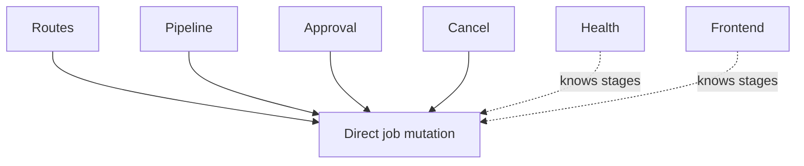

**After**

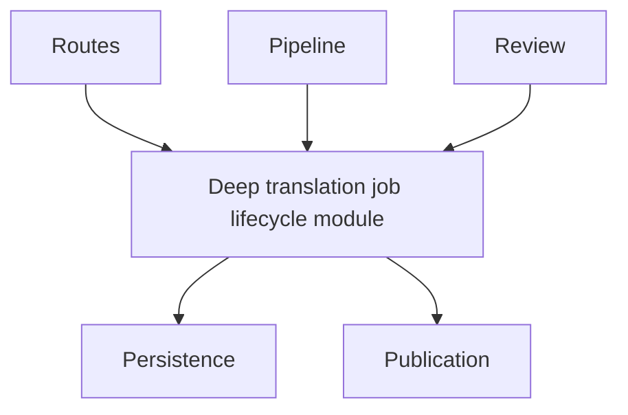

**Test surface**

- Legal and illegal transition matrix.
- Awaiting-review to inpainting transition.
- Cancellation from every nonterminal stage.
- No transitions after terminal state.
- Publication only after committed transition.

---

### 2. Local persistence module

**Recommendation: Strong**

**Files**

- `backend/main.py:122-124`
- `backend/main.py:676-925`
- `backend/tests/test_projects_workflow.py:7-18`
- `backend/tests/test_api_response_models.py:9-16`
- `docker-compose.yml`

**Problem**

Raw `jobs_db` and `projects_db` dictionaries are both interface and implementation. Routes, synthesis pipeline, SSE, health, and tests know record shape and mutability. Awaiting-review state stores live `TextBlock` objects, including NumPy masks, so durable persistence has no safe representation.

**Solution**

Replace direct dictionary access with one cohesive persistence module. Use in-memory and durable local storage as real adapters at one seam. Do not create one shallow module per record type.

**Benefits**

- Locality: serialization, atomic updates, recovery, ordering, and migration stay together.
- Leverage: production and tests cross same persistence interface.
- Translation jobs and project sessions survive restart.
- Test setup stops mutating global implementation.

**Deletion test**

Deleting proposed module spreads raw reads and writes back across routes, pipeline stages, SSE, health, and tests.

**Before**

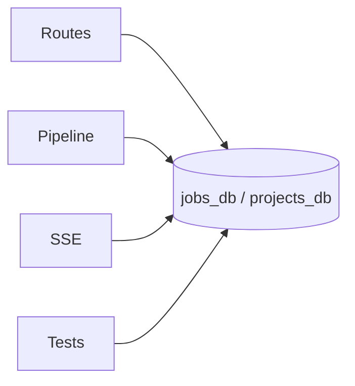

**After**

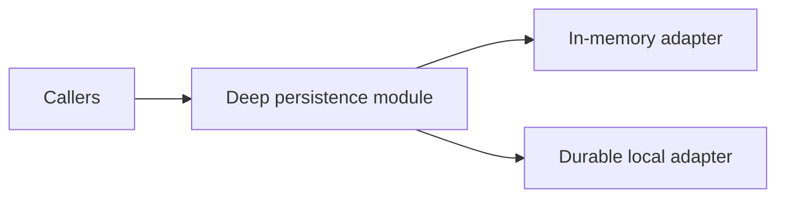

**Test surface**

- Restart recovery.
- Awaiting-review state persistence.
- Atomic project membership updates.
- Artifact-reference reconciliation.
- Storage failure before publication.

---

### 3. Synthesis pipeline module

**Recommendation: Strong**

**Files**

- `backend/main.py:213-398`
- `backend/main.py:401-627`
- `backend/synthesis/segmentation.py`
- `backend/synthesis/inpainting.py`
- `backend/synthesis/typesetting.py`
- `backend/tests/test_synthesis_regressions.py`

**Problem**

Segmentation, inpainting, and typesetting modules contain deep implementations, but `main.py` assembles their fallback policy, model lifecycle, mask construction, conversion, and resource ordering. Synthesis pipeline interface is therefore spread across caller implementation.

**Solution**

Deepen one synthesis pipeline module between translation job lifecycle and image-processing adapters. Keep stage sequence, fallback behavior, VRAM policy, text-block transformations, and artifact production inside implementation.

**Benefits**

- Locality: fallback and resource policy concentrate.
- Leverage: routes, future workers, retry behavior, and tests learn one interface.
- Tests avoid FastAPI, global state, and large model downloads.
- Existing deep image modules remain intact.

**Deletion test**

Deleting synthesis algorithms spreads hundreds of lines of image complexity. Deleting proposed pipeline composition spreads orchestration back into job lifecycle and workers. Both earn depth.

**Adapter note**

LaMa and OpenCV are two real internal adapters. General provider/plugin interfaces remain hypothetical. Roadmap defers extension system to Phase 4.

**Before**

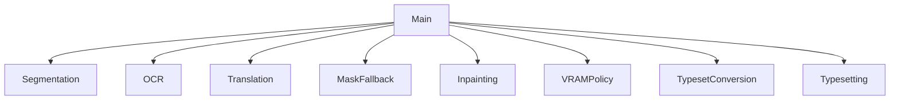

**After**

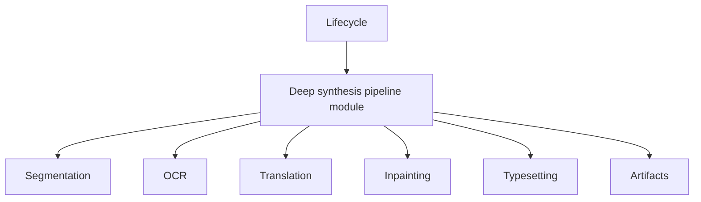

**Test surface**

- Normal flow pauses at human review gate.
- No-bubble fallback.
- OCR failure stops translation.
- Approval resumes at inpainting.
- Cancellation stops later work.
- Resources release on success and failure.

---

### 4. Human review gate module

**Recommendation: Strong**

**Files**

- `backend/main.py:496-510`
- `backend/main.py:710-752`
- `backend/synthesis/segmentation.py:39-48`
- `frontend/src/features/manga-translator/components/TranslationEditor.tsx`
- `frontend/src/features/manga-translator/components/MangaFileItem.tsx:186-193`
- `frontend/src/features/manga-translator/components/MangaTranslator.tsx:881-955`

**Problem**

Human review gate has two backend text-block representations, duplicate frontend modal ownership, stale job snapshots, arbitrary `Partial<ProcessedManga>` patches, and validation split between UI and route. Segmentation-owned `TextBlock` leaks OCR and translation state across seams.

**Solution**

Deepen one human review gate module. Own one text-block truth, draft lifecycle, validation, identity/coordinate invariants, approval eligibility, and authoritative reconciliation. HTTP remains adapter.

**Benefits**

- Locality: review validation and text-block linkage stay together.
- Leverage: browser, future CLI, persistence, and tests use one interface.
- Segmentation implementation stops owning translation state.
- Approval no longer fabricates lifecycle state in visual modules.

**Deletion test**

Deleting proposed module spreads review mapping, validation, approval, state reconciliation, and resume rules across every entry point.

**Before**

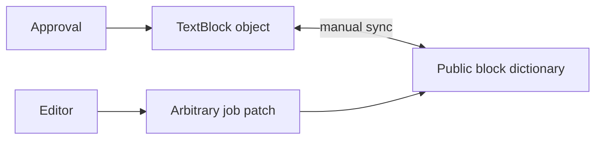

**After**

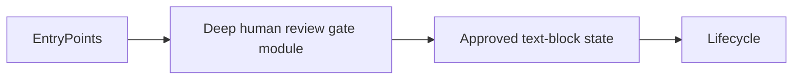

**Test surface**

- Unknown block ID.
- Empty/partial translation policy.
- Approval outside review state.
- Duplicate approval.
- Coordinate and source-text invariants.
- Authoritative update while review is open.

---

### 5. Backend representation adapter

**Recommendation: Strong**

**Files**

- `frontend/src/features/manga-translator/api/mangaApi.ts`
- `frontend/src/features/manga-translator/types/index.ts`
- `frontend/src/features/manga-translator/components/MangaTranslator.tsx:100-156`
- `frontend/src/features/manga-translator/components/MangaTranslator.tsx:255-270`
- `frontend/src/features/manga-translator/components/MangaFileItem.tsx:69-75`
- `backend/main.py:183-193`
- `backend/main.py:814-825`

**Problem**

HTTP, SSE, and local patches normalize URL fields, statuses, and aliases differently. `ProcessedManga` exposes snake-case and camel-case fields together. Backend status deliberately omits fields that frontend polling expects. Current adapter seam is real but shallow.

**Solution**

Deepen backend representation adapter so HTTP and SSE adapters produce one trusted frontend translation job representation. Keep URL resolution, field naming, status compatibility, optional-field preservation, and wire validation inside implementation.

**Benefits**

- Locality: transport compatibility rules live once.
- Leverage: all visual modules and tests learn one interface.
- HTTP and SSE contracts become consistent.
- Missing optional fields stop erasing known state.

**Deletion test**

Deleting normalization spreads aliases and relative URLs into every visual caller. Two transport adapters prove seam is real.

**Before**

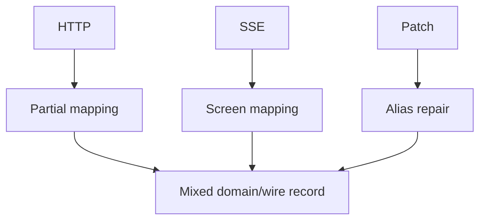

**After**

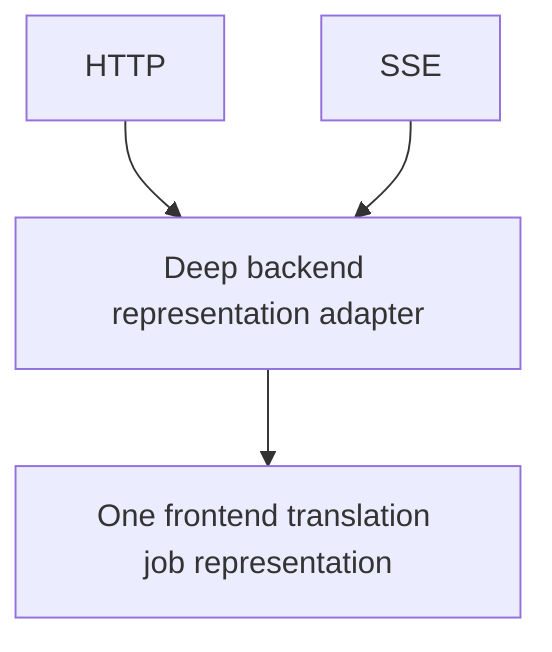

**Test surface**

- Relative and absolute artifact URLs.
- Status compatibility across HTTP and SSE.
- Partial payload preservation.
- Invalid stream payload.
- Contract parity between list, status, and SSE.

---

### 6. Project session module

**Recommendation: Worth exploring**

**Files**

- `backend/main.py:676-692`
- `backend/main.py:828-925`
- `backend/tests/test_projects_workflow.py`
- `frontend/src/features/manga-translator/components/MangaTranslator.tsx:290-350`
- `frontend/src/features/manga-translator/components/MangaTranslator.tsx:1061-1125`
- `frontend/src/features/manga-translator/types/index.ts:46-52`

**Problem**

Project membership has two writable owners: translation job `project_id` and project session `job_ids/page_order`. Routes manually repair both directions. Frontend render code joins, sorts, repairs, partitions, and calculates project session state. Duplicate page IDs can pass backend set equality.

**Solution**

Deepen one project session module at membership/order seam. Own membership, stable page order, rename/delete semantics, translation job projection, and project session lifecycle summaries.

**Benefits**

- Locality: membership and order invariants stay together.
- Leverage: upload, reorder, delete, export, persistence, and tests use one interface.
- Visual modules consume prepared project session state.
- Invalid project association becomes directly testable.

**Deletion test**

Deleting proposed module spreads dual-write consistency back into upload, reorder, deletion, persistence recovery, export, and rendering.

**Before**

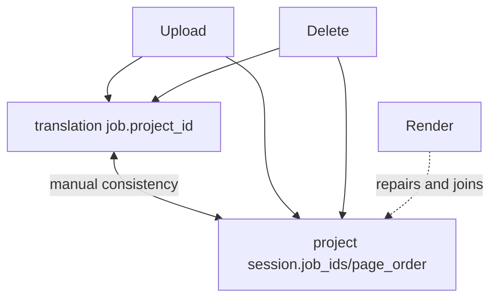

**After**

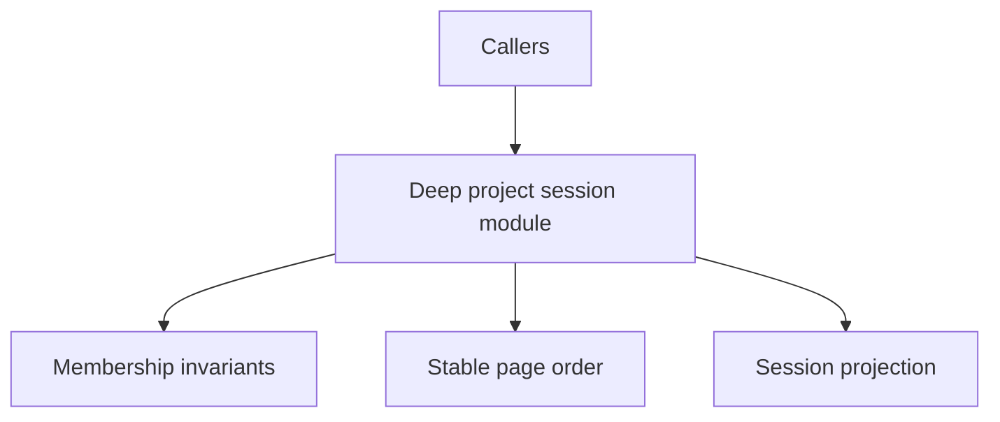

**Test surface**

- Nonexistent project rejection.
- Duplicate/missing/foreign page IDs.
- Atomic deletion and disassociation.
- Ordering after restart.
- Concurrent upload ordering.

---

### 7. Synchronization module after deletion test

**Recommendation: Speculative**

**Files**

- `frontend/src/features/manga-translator/components/MangaTranslator.tsx:67-232`
- `frontend/src/features/manga-translator/components/MangaTranslator.tsx:255-374`
- `frontend/src/features/manga-translator/components/MangaFileItem.tsx:53-87`
- `frontend/src/features/manga-translator/components/TranslationEditor.tsx:50-71`
- `backend/main.py:991-1054`

**Problem**

HTTP snapshots, SSE snapshots, per-row polling, temporary uploads, and optimistic patches compete without source precedence. Visual modules create timers, event streams, object URLs, and mutation policy directly.

**Solution**

Run deletion test first:

1. Remove redundant per-row polling if SSE supplies authoritative updates.
2. Keep HTTP refresh as explicit recovery adapter.
3. Remove local deletion success when backend deletion fails.
4. Deepen remaining synchronization behavior only if race complexity survives.

If still needed, module owns source precedence, optimistic reconciliation, connection recovery, and object URL lifetime.

**Benefits**

- Locality: temporal race policy concentrates.
- Leverage: visual modules receive stable state and emit intent.
- Fewer network writers and timers.
- Synchronization tests avoid rendering details.

**Deletion test**

Current polling likely fails deletion test because SSE already supplies state. Do not add module before removing redundant behavior.

---

## Shallow modules and surfaces to delete or absorb

### `backend/job_errors.py`

**Recommendation: Strong deletion/absorption**

One production caller, three names, tiny implementation. Deleting module moves behavior to OCR-owning module without duplication. Current module fails deletion test.

### `backend/synthesis/__init__.py`

Comment exposes no behavior or depth. Keep file only as explicit package marker if packaging requires it.

### `SegmentationEngine.refine_masks`

Internal-only implementation exposed as public interface. Internalize it. No caller or test needs separate seam.

### Caller-side model lifecycle methods

`unload_all()` and `release()` expose VRAM implementation details. Internalize resource policy in synthesis implementation.

### Caller-side font resolution

`main.py` and typesetting implementation both know font asset layout. Delete caller resolution; preserve configuration intent only.

### Private implementation tests

Current tests call private typesetting and inpainting helpers. Preserve synthetic fixtures but move assertions to public module interfaces. Interface is test surface.

### Frontend feature barrel

App needs only `MangaTranslator`. Raw types and transport module exports broaden interface without leverage. Verify no external consumers, then narrow.

### Ignored translation configuration

`mangaApi.upload(file, _config, projectId)` ignores `_config`. Interface is false. Delete ignored argument now, or make backend consume per-job translation configuration. Do not preserve misleading interface.

## Recommended sequence

1. Deepen translation job lifecycle module.
2. Replace raw dictionaries with local persistence module.
3. Deepen synthesis pipeline module.
4. Deepen human review gate module and one text-block truth.
5. Deepen backend representation adapter.
6. Deepen project session module.
7. Apply deletion test to synchronization writers.
8. Split `MangaTranslator.tsx` only after deep module seams exist.

## Top recommendation

**Translation job lifecycle module first.**

Highest leverage and locality. Persistence, human review gate, project session, synthesis, cancellation, and SSE all depend on coherent transition policy. Without this module, later refactors preserve direct mutation under new file names.

## Constraints preserved

- No concrete interfaces proposed.
- No provider plugin system proposed; one adapter remains hypothetical.
- No queue framework proposed; current execution adapter remains singular.
- No JSX-only extraction proposed; it would create shallow modules with large interfaces.
- No ADR conflicts found because no ADRs exist.
