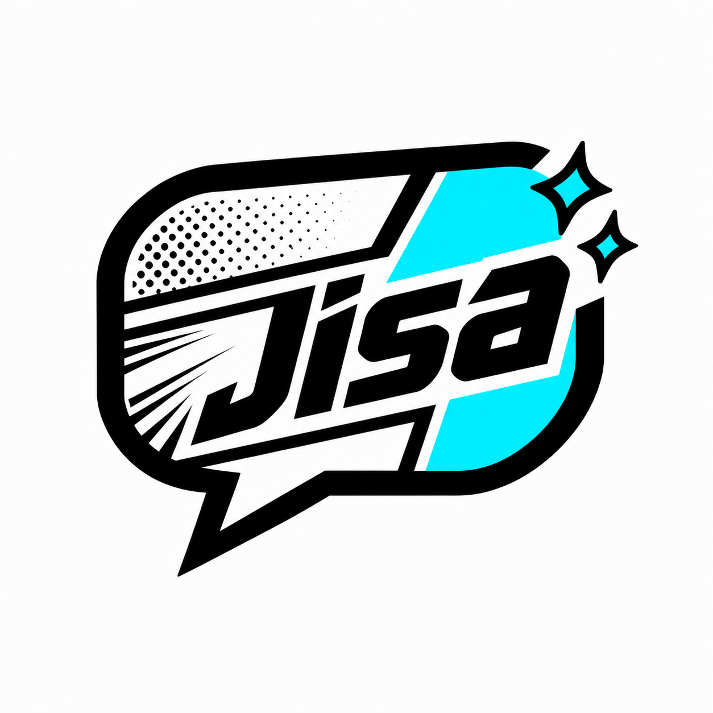
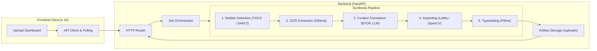

<div align="center">



# Jisa

*An end-to-end local-first manga translation system with speech bubble detection, OCR, page-context translation, inpainting, and typesetting.*

[](https://www.python.org/)
[](https://fastapi.tiangolo.com/)
[](https://nextjs.org/)
[](https://www.typescriptlang.org/)
[](https://tailwindcss.com/)
[](https://www.docker.com/)

[Overview](#overview) • [Key Features](#key-features) • [Architecture](#architecture) • [Getting Started](#getting-started) • [Configuration](#configuration) • [API Reference](#api-reference) • [Verification](#verification)

</div>

---

## Overview

**Jisa** is a local-first system designed to automate the complex manga translation pipeline. Translating manga manually requires significant effort: detecting speech bubbles, extracting original text, maintaining consistent character tone across dialogue, erasing text without ruining background artwork, and typesetting new text into constrained bubble geometries.

This project automates the entire end-to-end process:

1. **Speech Bubble Detection**: Segment dialogue areas accurately using vision models.
2. **Text Extraction (OCR)**: Extract Japanese or original source text per bubble using Ollama.
3. **Contextual Translation**: Translate extracted dialogue into Thai with page-level context for consistent tone and pronouns.
4. **Text Removal & Inpainting**: Erase original text while preserving underlying manga artwork.
5. **Typesetting**: Render and composite translated Thai dialogue cleanly inside speech bubble boundaries.

> [!TIP]
> You can run the entire pipeline locally without cloud costs using local Ollama OCR models and a CUDA-capable GPU for vision processing.

---

## Key Features

- **Batch Processing Dashboard**: Drag-and-drop interface for uploading single or multi-page manga chapters.
- **Advanced Vision Models**: Integrates YOLO-based bubble detection and SAM 2 (Segment Anything 2) mask refinement.
- **Page-Context Translation**: Uses an OpenAI-compatible BYOK (Bring Your Own Key) endpoint to maintain narrative context across speech bubbles.
- **Deep Inpainting Engine**: Employs `simple-lama-inpainting` for clean text removal with OpenCV fallback mechanisms.
- **Smart Typesetting**: Language-aware Thai wrapping and text scaling using Pillow and custom fonts.
- **Side-by-Side Review**: Live dashboard allowing comparison of original, cleaned, and translated pages.
- **VRAM Management**: Automatic model unloading between execution stages to fit within modest GPU budgets.
- **Docker-Ready**: Full container setup via Docker Compose for easy deployment.

---

## Architecture

The system is split into a **FastAPI** backend for heavy vision/AI workloads and a **Next.js 16** frontend for user interaction.



> [!NOTE]
> The backend prioritizes resilience over hard failure. Fallbacks exist for detection gaps, missing inpainting weights, or external API timeouts to ensure pages are still processed.

---

## Getting Started

### Prerequisites

- **Python**: `3.12+` with [`uv`](https://github.com/astral-sh/uv) package manager recommended
- **Node.js**: `20+` (or [`bun`](https://bun.sh))
- **Ollama**: Running locally for OCR inference (e.g., `glm-ocr` model)
- **GPU (Optional)**: CUDA-compatible GPU recommended for fast vision inference

---

### Quick Start (Windows Launcher)

Run the included batch script to launch both backend and frontend servers simultaneously:

```cmd
start.bat
```

- **Frontend Dashboard**: `http://localhost:3000`
- **Backend API**: `http://localhost:8000`
- **Swagger Documentation**: `http://localhost:8000/docs`

---

### Running with Docker Compose

Deploy the entire stack in isolated containers:

```bash
docker-compose up --build
```

> [!IMPORTANT]
> Docker containers use `host.docker.internal` to connect to Ollama running natively on your host machine. Ensure Ollama is running before starting containers.

---

### Manual Setup

#### 1. Backend Setup

```bash
cd backend

# Install dependencies using uv
uv sync

# Run the FastAPI server
uv run uvicorn main:app --reload --host 0.0.0.0 --port 8000
```

#### 2. Frontend Setup

```bash
cd frontend

# Install dependencies
npm install

# Start development server
npm run dev
```

---

## Configuration

Configure backend environment variables by creating a `backend/.env` file:

```env
# Ollama OCR Configuration
OLLAMA_URL=http://localhost:11434
OCR_MODEL=glm-ocr

# Translation Endpoint (BYOK OpenAI-Compatible)
BYOK_API_KEY=your_api_key_here
BYOK_API_BASE=https://api.openai.com/v1
BYOK_MODEL=gpt-4o

# Translation Settings
PAGE_CONTEXT_TRANSLATION=true
# THAI_SYSTEM_PROMPT=  # Optional: Override built-in Japanese-to-Thai system prompt
```

---

## API Reference

| Method | Endpoint | Description |
| :--- | :--- | :--- |
| `GET` | `/` | Health check endpoint |
| `GET` | `/api/ollama/status` | Verify Ollama OCR connectivity |
| `POST` | `/api/translate` | Upload manga page(s) and start processing job |
| `GET` | `/api/status/{job_id}` | Retrieve job status, progress, and output artifact URLs |
| `GET` | `/api/typesetting/options` | Retrieve available font options, size ranges, alignments, and padding ratios |
| `POST` | `/api/jobs/{job_id}/regions/{region_id}/typeset-preview` | Generate live cropped preview overlay with layout metrics for a single region |

### Upload Request Example

```bash
curl -X POST "http://localhost:8000/api/translate" \
  -H "accept: application/json" \
  -F "file=@manga_page.jpg"
```

---

## Verification

The backend includes a regression test suite for mask generation, bubble geometry, and typesetting layout calculations:

```bash
cd backend
uv run python -m unittest
```
