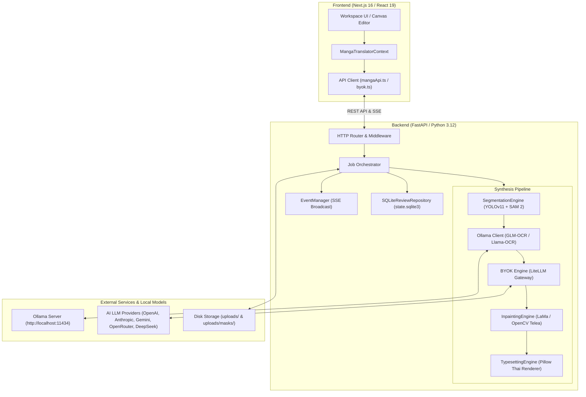
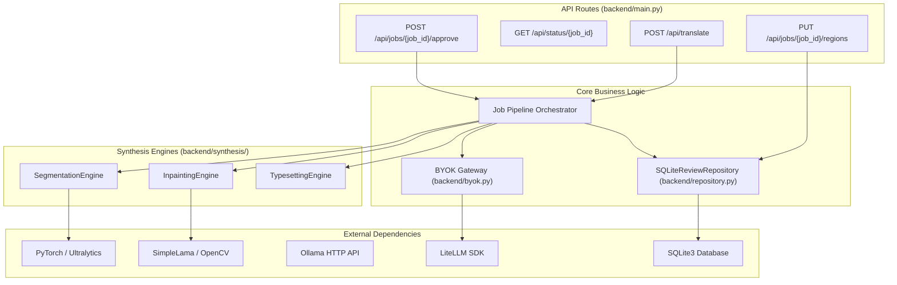
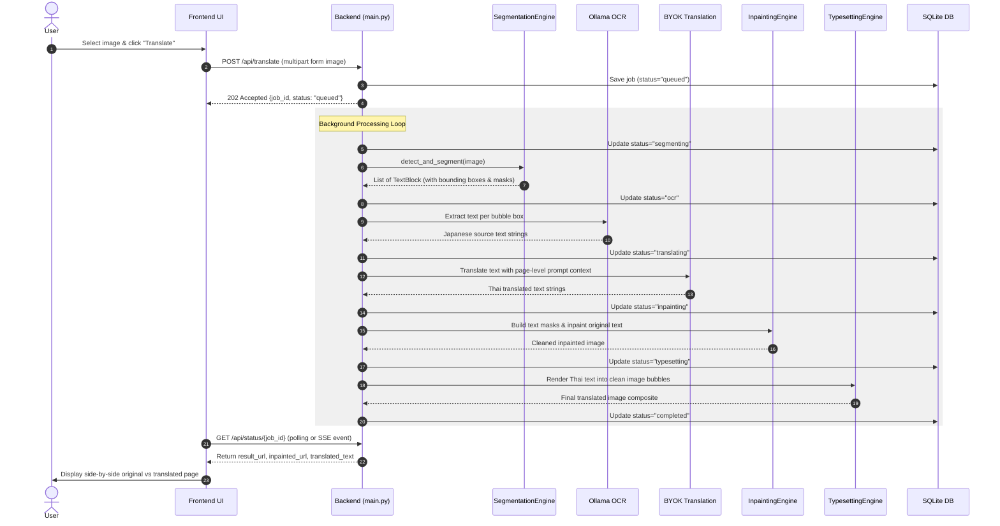
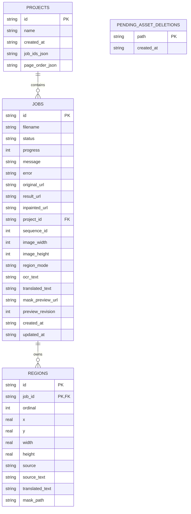
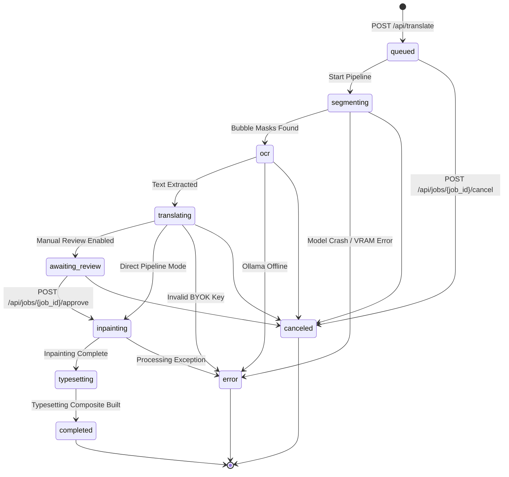

# Codebase Guide — AI Manga Translator (Jisa)

Comprehensive exploration, system architecture, module catalog, and onboarding guide for the **AI Manga Translator (Jisa)** repository.

---

## 1. Executive Summary

**AI Manga Translator (Jisa)** is a local-first, end-to-end automated manga translation and typesetting platform. The system takes raw manga comic pages (in Japanese or other source languages), detects speech bubble regions using computer vision models, extracts text using Optical Character Recognition (OCR), translates the dialogue into natural Thai using context-aware LLMs, inpaints original Japanese text out of the page artwork, and typesets the formatted Thai text back inside the speech bubbles while preserving original art line-work and bubble geometry.

The application addresses the bottleneck of manual scanlation workflows (where cleaning, translating, and typesetting a single chapter manually takes hours). By automating detection, OCR, translation, inpainting, and typesetting into an integrated pipeline—supported by an interactive human-in-the-loop review interface—the system reduces page translation time from tens of minutes to seconds.

The architecture is divided into two primary sub-systems:
1. **Python FastAPI Backend (`backend/`)**: Manages model loading, sequential VRAM optimization on consumer GPUs (e.g., RTX 4060 8GB), image processing via OpenCV/NumPy/Pillow, computer vision inference via PyTorch/Ultralytics (YOLOv11 & SAM 2), LaMa text inpainting, LiteLLM-powered BYOK (Bring Your Own Key) translation, SQLite state persistence, and real-time status streaming over Server-Sent Events (SSE).
2. **Next.js 16 Frontend (`frontend/`)**: A React 19 single-page dashboard built with Tailwind CSS v4 and Framer Motion. It provides drag-and-drop batch upload, job execution tracking, interactive speech-bubble region editing (moving, resizing, deleting, adding custom boxes), side-by-side visual comparison (Original vs. Cleaned vs. Typeset), and project session management.

The codebase is currently in an advanced working prototype / functional MVP state. Core pipeline stages (segmentation, OCR, translation, inpainting, typesetting, human review override, BYOK providers) are fully implemented and covered by automated regression tests in `backend/tests/`.

### Codebase Understanding Confidence

**Confidence Level: High**

* **Evidence**:
  - Explored all entry points: `backend/main.py`, `backend/repository.py`, `backend/byok.py`, `backend/synthesis/segmentation.py`, `backend/synthesis/inpainting.py`, `backend/synthesis/typesetting.py`.
  - Analyzed Next.js routes and feature components: `frontend/app/(workspace)/`, `frontend/src/features/manga-translator/`.
  - Executed backend test discovery (`uv run python -m unittest discover -s tests`), confirming test coverage across API models, region overrides, BYOK configurations, repository persistence, and synthesis pipeline regressions.

---

## 2. Product & Business Context

### Product Objective
Provide an end-to-end, high-quality, local-first manga translation tool that yields publication-ready translated pages. The primary target language is Thai, utilizing custom literary system prompts to handle Japanese honorifics, character personas, and dialogue tone.

### User Personas
1. **Scanlator / Translator**: Needs fast, accurate text extraction and translation draft generation, plus fine-grained region-adjustment tools to correct bounding boxes and tweak translated text before typesetting.
2. **Solo Reader**: Wants one-click batch upload of manga chapters to generate readable Thai pages locally without manual editing.
3. **Content Editor / Quality Assurance**: Requires side-by-side comparison of original Japanese artwork against cleaned artwork and rendered Thai text to verify visual accuracy.

### Core Workflows
1. **Batch Upload & Automatic Processing**: User uploads multiple manga page images into a project session in a single atomic `multipart/form-data` request; each page receives a native, contiguous `sequence_id` in SQLite schema v2, and the pipeline processes each page through segmentation, OCR, translation, inpainting, and typesetting.
2. **Human-in-the-Loop Review Gate**: When enabled, the pipeline pauses after OCR & translation at the `awaiting_review` state, allowing the user to adjust bounding boxes on a web canvas, correct translated text, or force full-page OCR before proceeding to inpainting and typesetting.
3. **BYOK API Provider Configuration**: Users configure their preferred translation provider (OpenAI, Anthropic, Gemini, OpenRouter, DeepSeek, Ollama, or Custom OpenAI-compatible endpoints) via standard HTTP request headers or backend environment variables.
4. **Project Session Organization**: Each project session natively owns an ordered page sequence in SQLite (`jobs.sequence_id`). Page ordering is stable across status updates and backend restarts. Deleting a project session cascades through member jobs, regions, and physical disk assets.

### Non-Goals
- Automated commercial publishing without human review.
- Multi-tenant cloud SaaS with billing, authentication, and multi-user access control (the current system is designed for single-user local deployment).

---

## 3. Technology Stack

| Area | Technology | Version | Purpose | Evidence |
| :--- | :--- | :--- | :--- | :--- |
| **Backend Language** | Python | 3.12+ | Core backend runtime & ML processing | `backend/pyproject.toml` |
| **Backend Framework** | FastAPI | 0.115+ | HTTP REST API, background tasks, SSE streaming | `backend/main.py` |
| **ASGI Server** | Uvicorn | 0.34+ | Asynchronous web server | `backend/pyproject.toml` |
| **Image Processing** | OpenCV, NumPy, Pillow | cv2 4.11+, numpy 2.2+, Pillow 11.1+ | Array math, mask manipulation, inpainting, font typesetting | `backend/synthesis/` |
| **ML Framework** | PyTorch & Ultralytics | PyTorch 2.6+, Ultralytics 8.3+ | GPU/CUDA acceleration, YOLOv11 bubble detection, SAM 2 segmentation | `backend/synthesis/segmentation.py` |
| **Inpainting Engine** | simple-lama-inpainting | 0.1+ (with OpenCV Telea fallback) | Deep learning text removal (Fast Fourier Convolutions) | `backend/synthesis/inpainting.py` |
| **OCR Provider** | Ollama (Local) | GLM-OCR / Llama-OCR | Local vision-language model OCR extraction | `backend/main.py:66-67` |
| **LLM Gateway** | LiteLLM | 1.61+ | Universal BYOK multi-provider translation client | `backend/byok.py` |
| **Database** | SQLite3 | Schema v2 | Local durable persistence for jobs, regions, projects, pending asset deletions | `backend/repository.py` |
| **Frontend Framework** | Next.js (App Router) | 16.1.4 (React 19) | Web UI, workspace routing, project management | `frontend/package.json` |
| **Frontend Styling** | Tailwind CSS & Framer Motion | Tailwind v4, Framer Motion 12 | UI components, dark mode, smooth transitions | `frontend/package.json` |
| **Frontend State / API** | Axios & React Context | Axios 1.7+ | Backend HTTP polling, SSE subscription, state dispatch | `frontend/src/features/manga-translator/` |
| **Testing** | Python unittest / Vitest | Standard library / Vitest 3 | Backend API & regression tests, frontend component tests | `backend/tests/`, `frontend/vitest.config.ts` |

---

## 4. Repository Structure

```text
Jisa/
├── ARCHITECTURE.md                  # High-level system architecture specification
├── ARCHITECTURE_REVIEW.md           # Architecture deepening & refactoring recommendations
├── README.md                        # Project introduction & quickstart guide
├── docker-compose.yml               # Multi-container setup (Backend + Frontend)
├── backend/
│   ├── main.py                      # FastAPI entry point, route definitions, job orchestration
│   ├── repository.py                # SQLite ReviewRepository interface & implementation (Schema v2)
│   ├── byok.py                      # LiteLLM provider mapping & BYOK completion engine
│   ├── job_errors.py                # Custom exception types (OcrError, etc.)
│   ├── pyproject.toml               # Python dependencies (managed via uv)
│   ├── assets/fonts/                # Thai TTF/OTF fonts for typesetting (Itim, NotoSansThai)
│   ├── synthesis/                   # Core image processing engines
│   │   ├── segmentation.py          # YOLO11 + SAM 2 speech bubble detection & mask generation
│   │   ├── inpainting.py            # LaMa deep inpainting with OpenCV Telea fallback
│   │   └── typesetting.py           # Thai word wrapping, auto-fitting, mask fencing renderer
│   └── tests/                       # Automated backend test suite (39 test cases)
│       ├── test_api_response_models.py
│       ├── test_byok.py
│       ├── test_pipeline_region_overrides.py
│       ├── test_projects_workflow.py
│       ├── test_region_api.py
│       ├── test_repository.py
│       └── test_synthesis_regressions.py
├── frontend/
│   ├── app/                         # Next.js App Router structure
│   │   ├── layout.tsx               # Root HTML layout
│   │   └── (workspace)/             # Main workspace layout group
│   │       ├── projects/            # Project session view & detail routes
│   │       └── overview/            # Health check & system status dashboard
│   ├── src/
│   │   └── features/
│   │       └── manga-translator/    # Manga translation feature domain
│   │           ├── api/             # Axios API client (mangaApi.ts, byok.ts)
│   │           ├── components/      # UI components (ProjectWorkspace, RegionCanvas, etc.)
│   │           ├── context/         # MangaTranslatorContext state provider
│   │           └── types/           # TypeScript data interfaces (JobStatus, BlockItem, etc.)
│   ├── package.json                 # Node.js dependencies & scripts
│   └── vitest.config.ts             # Vitest frontend test runner configuration
└── docs/
    └── plans/                       # Architectural decisions & implementation plans
```

---

## 5. System Architecture

The system follows a **Monolithic API Backend + Decoupled SPA Frontend** architecture pattern.



### Architectural Principles & Boundaries
1. **Local-First & VRAM Safety**: Computer vision models (YOLO, SAM 2, LaMa) and Ollama OCR require significant GPU memory. Models are loaded lazily on first use and explicitly released (`unload_all()`, `release()`) between pipeline stages so they do not compete for VRAM on 8 GB GPUs.
2. **Graceful Fallbacks**:
   - If SAM 2 segmentation fails, the pipeline falls back to YOLO bounding boxes.
   - If LaMa inpainting fails or is not installed, the pipeline falls back to OpenCV Telea inpainting.
   - If bubble-level OCR yields empty text, full-page OCR is attempted as a fallback.
3. **Synchronous REST with Asynchronous Job Execution**: Upload endpoints (`POST /api/translate`) accept files, return an HTTP 202 Accepted status with a `job_id`, and immediately dispatch processing into a background task while broadcasting progress updates via SSE (`/api/stream/events`) and status polling (`GET /api/status/{job_id}`).

---

## 6. Module Catalog

### Module Overview Table

| Module | Responsibility | Entry Points | Data Owned | Dependencies | Status |
| :--- | :--- | :--- | :--- | :--- | :--- |
| **Job & Project Lifecycle** | Job submission, state transitions, project session grouping, SQLite persistence | `backend/main.py`, `backend/repository.py` | `jobs`, `projects`, `pending_asset_deletions` tables | FastAPI, SQLite3 | Production-ready |
| **Segmentation Engine** | Speech bubble detection & mask refinement | `backend/synthesis/segmentation.py` | Bubble bounding boxes & binary uint8 masks | PyTorch, Ultralytics (YOLO, SAM2), OpenCV | Production-ready |
| **OCR & Text Extraction** | Japanese character recognition per bubble | `backend/main.py` | Extracted source text per block | httpx, Ollama API | Production-ready |
| **Contextual Translation** | Page-context dialogue translation to Thai | `backend/main.py`, `backend/byok.py` | Translated Thai text per block | LiteLLM, OpenAI/Anthropic/Gemini APIs | Production-ready |
| **Inpainting Engine** | Text removal & background restoration | `backend/synthesis/inpainting.py` | Mask previews & cleaned image artifacts | simple-lama-inpainting, OpenCV, Pillow | Production-ready |
| **Typesetting Engine** | Thai text formatting, auto-fitting, & rendering | `backend/synthesis/typesetting.py` | Final composite translated image | Pillow (ImageDraw, ImageFont), PyThaiNLP / regex | Production-ready |
| **Frontend Workspace UI** | Drag-and-drop upload, canvas region editing, status monitoring | `frontend/src/features/manga-translator/` | React client state, active project selections | Next.js, React 19, Tailwind CSS, Axios | Production-ready |

---

### Module Details

#### Module: Job & Project Lifecycle Management
* **Purpose**: Coordinates job queues, state persistence, sequence ordering within projects, and real-time SSE broadcasts.
* **Important Files**:
  - `backend/main.py`
  - `backend/repository.py`
* **Entry Points**:
  - `POST /api/translate`: Submit images for translation.
  - `GET /api/status/{job_id}`: Poll job status.
  - `POST /api/projects`: Create project session.
  - `PUT /api/projects/{project_id}/reorder`: Reorder pages in project.
* **Data Ownership**: SQLite tables (`jobs`, `projects`, `regions`, `pending_asset_deletions`).
* **Dependencies**: FastAPI, SQLite3, Pydantic.

#### Module: Speech Bubble Segmentation Engine
* **Purpose**: Detects speech bubbles on comic pages and produces tight binary masks.
* **Important Files**:
  - `backend/synthesis/segmentation.py`
* **Entry Points**:
  - `SegmentationEngine.detect_and_segment(image_np)`
* **Main Types**: `TextBlock(id, box, confidence, text, translated_text, mask)`
* **Dependencies**: PyTorch, Ultralytics YOLOv11 (`yolo11n-seg.pt` / `best.pt`), SAM 2 (`sam2_b.pt`), OpenCV.

#### Module: OCR Engine
* **Purpose**: Performs text recognition inside detected speech bubbles using local vision LLMs.
* **Important Files**:
  - `backend/main.py:401-440`
* **Entry Points**:
  - `_perform_ocr(image_np, blocks)`
* **Dependencies**: Local Ollama server (`GLM-OCR` model), `httpx`.

#### Module: Contextual Translation Engine
* **Purpose**: Translates Japanese text into natural Thai using full-page context to maintain pronoun and tone consistency.
* **Important Files**:
  - `backend/main.py:441-520`
  - `backend/byok.py`
* **Entry Points**:
  - `byok_completion(messages, config)`
* **Dependencies**: LiteLLM, BYOK API Keys (OpenAI, Anthropic, Gemini, OpenRouter, DeepSeek).

#### Module: Inpainting Engine
* **Purpose**: Removes original Japanese text glyphs from speech bubbles while preserving bubble borders and background artwork.
* **Important Files**:
  - `backend/synthesis/inpainting.py`
* **Entry Points**:
  - `InpaintingEngine.process_blocks(image_np, masks, dilation_px=12)`
  - `InpaintingEngine.build_text_masks(image_np, bubble_masks)`
* **Dependencies**: `simple-lama-inpainting` (LaMa), OpenCV Telea inpainting fallback.

#### Module: Typesetting Engine
* **Purpose**: Formats, auto-fits, wraps, and renders translated Thai text into speech bubbles with mask clipping ("bubble fencing").
* **Important Files**:
  - `backend/synthesis/typesetting.py`
* **Entry Points**:
  - `TypesettingEngine.render(base_image, blocks)`
* **Main Types**: `TypesetBlock(id, box, text, font_size, color, mask)`
* **Dependencies**: Pillow (`ImageDraw`, `ImageFont`), Thai custom fonts (`Itim-Regular.ttf`, `NotoSansThai-Regular.ttf`).

---

## 7. Module Dependency Map



---

## 8. Critical User & Business Flows

### Flow 1: End-to-End Automated Page Translation



---

### Flow 2: Human Review & Manual Region Override

1. **Trigger**: User opens a page in `awaiting_review` state or clicks "Edit Regions" in `frontend/src/features/manga-translator/components/ProjectWorkspace.tsx`.
2. **Preconditions**: Job has completed segmentation and OCR/translation steps.
3. **Main Flow**:
   - Frontend loads bounding boxes via `GET /api/jobs/{job_id}/regions`.
   - User edits, moves, resizes, adds, or deletes bounding boxes on the interactive HTML canvas (`RegionCanvas.tsx`).
   - User updates Japanese source text or Thai translated text in `TranslationEditor.tsx`.
   - Frontend calls `PUT /api/jobs/{job_id}/regions` with modified region payloads.
   - User clicks "Approve & Process" (`POST /api/jobs/{job_id}/approve`).
   - Backend resumes pipeline execution from `inpainting` -> `typesetting` -> `completed`.
4. **Data Changes**: `regions` table records in SQLite are replaced; job status transitions from `awaiting_review` to `inpainting`.

---

## 9. API & Interface Surface

| Method | Path | Module | Authentication | Purpose |
| :--- | :--- | :--- | :--- | :--- |
| `GET` | `/` | System | None | Health check & welcome status |
| `GET` | `/api/system/health` | System | None | Detailed hardware (CUDA, VRAM), Ollama, asset, & job stats |
| `GET` | `/api/ollama/status` | OCR | None | Verifies connection to Ollama local OCR server |
| `GET` | `/api/byok/providers` | Translation | None | Returns list of supported LLM provider presets |
| `POST` | `/api/byok/test` | Translation | None | Validates user BYOK API key & model credentials |
| `POST` | `/api/translate` | Jobs | None | Uploads page image & creates translation job (HTTP 202) |
| `GET` | `/api/status/{job_id}` | Jobs | None | Retrieves job status, progress, error logs, & result URLs |
| `GET` | `/api/jobs/{job_id}/regions` | Regions | None | Fetches detected/manual text regions & bounding boxes |
| `PUT` | `/api/jobs/{job_id}/regions` | Regions | None | Saves manual region bounding box & text overrides |
| `POST` | `/api/jobs/{job_id}/approve` | Pipeline | None | Approves review regions & triggers inpainting/typesetting |
| `POST` | `/api/jobs/{job_id}/cancel` | Pipeline | None | Cancels active translation job |
| `GET` | `/api/jobs` | Jobs | None | Lists all jobs across system or for specific project |
| `DELETE` | `/api/jobs/{job_id}` | Jobs | None | Deletes job & schedules asset file cleanup |
| `POST` | `/api/projects` | Projects | None | Creates a new project session to group pages |
| `GET` | `/api/projects` | Projects | None | Lists all project sessions |
| `PUT` | `/api/projects/{project_id}/reorder` | Projects | None | Updates page sequence ordering within a project |
| `DELETE` | `/api/projects/{project_id}` | Projects | None | Deletes project session & cascades to underlying jobs |
| `GET` | `/api/stream/events` | System | None | Real-time Server-Sent Events (SSE) status stream |

---

## 10. Data Model & Persistence

The application uses an embedded **SQLite** database (`uploads/state.sqlite3`) managed via `SQLiteReviewRepository` in `backend/repository.py` (Schema Version 2).



### Persistence Notes & Risks
- **Concurrency**: SQLite connection uses `check_same_thread=False` wrapped with Python `threading.RLock()` to ensure thread safety across FastAPI background workers.
- **Cascading Deletions**: Deleting a project or job automatically deletes child `regions` rows via SQL foreign key `ON DELETE CASCADE`. Associated image files on disk are registered into `pending_asset_deletions` for safe asynchronous disk deletion.

---

## 11. State Machines & Lifecycle



| Entity | State | Allowed Next States | Trigger | Guard / Rule |
| :--- | :--- | :--- | :--- | :--- |
| Job | `queued` | `segmenting`, `canceled`, `error` | Worker pickup | Image file exists on disk |
| Job | `segmenting` | `ocr`, `canceled`, `error` | Detection finish | Bubble boxes identified |
| Job | `ocr` | `translating`, `canceled`, `error` | OCR finish | Text extracted or fallback initialized |
| Job | `translating` | `awaiting_review`, `inpainting`, `error` | LLM finish | Translated strings generated |
| Job | `awaiting_review` | `inpainting`, `canceled` | Human approval | `PUT /api/jobs/{job_id}/regions` validated |
| Job | `inpainting` | `typesetting`, `error` | LaMa finish | Cleaned background image generated |
| Job | `typesetting` | `completed`, `error` | Render finish | Composite image saved to disk |

---

## 12. Authentication & Authorization

- **Current Security Posture**: Open / Single-User Local Application.
- **Authentication**: None. The API endpoints do not require session tokens or Bearer header checks.
- **Authorization**: All endpoints permit unrestricted reads/writes.
- **Production Recommendation**: If deployed to a shared or public cloud environment, a reverse proxy (e.g., Nginx with Basic Auth) or FastAPI OAuth2/JWT middleware must be introduced to protect `/api/*` routes.

---

## 13. Configuration & Environment

Environment variables are loaded from `backend/.env` via `python-dotenv`.

| Variable | Required | Default | Used By | Purpose | Sensitive |
| :--- | :--- | :--- | :--- | :--- | :--- |
| `OLLAMA_URL` | No | `http://localhost:11434` | Backend OCR | Local Ollama OCR API endpoint | No |
| `OCR_MODEL` | No | `glm-ocr` | Backend OCR | Model identifier for Ollama OCR | No |
| `BYOK_API_KEY` | No | `None` | `backend/byok.py` | API Key for translation provider | **Yes** |
| `BYOK_API_BASE` | No | `https://api.openai.com/v1` | `backend/byok.py` | Base URL for LLM provider | No |
| `BYOK_MODEL` | No | `gpt-4o` / `gpt-5.4-mini` | `backend/byok.py` | Translation LLM model identifier | No |
| `THAI_SYSTEM_PROMPT` | No | *(Built-in 3-Step prompt)* | `backend/main.py` | Custom Japanese->Thai translation prompt | No |
| `PAGE_CONTEXT_TRANSLATION` | No | `true` | `backend/main.py` | Enable page-level contextual translation | No |
| `DEVICE` | No | `cuda` | `segmentation.py`, `inpainting.py` | PyTorch compute device (`cuda` / `cpu`) | No |
| `TYPESETTING_FONT` | No | `None` | `typesetting.py` | Preferred custom Thai font filename | No |
| `STATE_DB_PATH` | No | `uploads/state.sqlite3` | `repository.py` | SQLite database file location | No |
| `MAX_UPLOAD_SIZE_BYTES` | No | `26214400` (25MB) | `main.py` | Maximum image upload file size | No |

---

## 14. External Integrations

| Integration | Purpose | Adapter File | Failure Handling Strategy | Config Variable |
| :--- | :--- | :--- | :--- | :--- |
| **Ollama Local API** | Japanese OCR text extraction | `backend/main.py:401-440` | Fallback to empty text block or full-page OCR pass | `OLLAMA_URL`, `OCR_MODEL` |
| **LiteLLM / BYOK** | Multilingual Japanese-to-Thai LLM translation | `backend/byok.py` | Return user-friendly authentication / model error message | `BYOK_API_KEY`, `BYOK_MODEL` |
| **HuggingFace / Ultralytics** | YOLOv11 & SAM 2 vision checkpoints download | `backend/synthesis/segmentation.py` | Fallback from custom HF repo to local `yolo11n-seg.pt` | `yolo_model_path`, `sam_model_path` |

---

## 15. Background Jobs & Async Processing

- **Job Executor**: FastAPI `BackgroundTasks` executes `_process_translation_job(job_id)` in the background without blocking HTTP response handling.
- **State Synchronization**: Jobs update their progress (0 to 100%) and current stage string in `jobs_db` and SQLite database `repository.save_job()`.
- **Event Streaming**: `event_manager.publish("job_updated", job_data)` broadcasts status changes to active SSE connections (`/api/stream/events`).

---

## 16. Error Handling & Observability

### Custom Exception Types
- `OcrError` (`backend/job_errors.py`): Raised when Ollama OCR server is unreachable or returns malformed response data.

### Health Endpoints
- `GET /api/system/health`: Reports status of Ollama connection, BYOK configuration, PyTorch CUDA GPU availability, available fonts, and job counter statistics.

---

## 17. Testing Strategy

### Test Execution Commands
```bash
# Run backend Python tests
cd backend
uv run python -m unittest discover -s tests

# Run frontend Vitest tests
cd frontend
npm run test
```

### Test Coverage Table

| Test Layer | Tool | Location | What It Covers | Gaps |
| :--- | :--- | :--- | :--- | :--- |
| **API Response Models** | Python unittest | `backend/tests/test_api_response_models.py` | Pydantic response schemas & status mappings | None |
| **BYOK Integration** | Python unittest | `backend/tests/test_byok.py`, `test_byok_api.py` | Header extraction, model mapping, Provider presets | Mock external LLM API calls |
| **Repository Persistence** | Python unittest | `backend/tests/test_repository.py` | SQLite schema migrations, foreign key cascades, region saves | None |
| **Pipeline & Regions** | Python unittest | `backend/tests/test_pipeline_region_overrides.py`, `test_region_api.py` | Region manual overrides, box conversions, approval flow | GPU inference requires mock |
| **Synthesis Regressions** | Python unittest | `backend/tests/test_synthesis_regressions.py` | Inpainting mask math, typesetting word wrapping & font loading | Full visual output assertion |
| **Frontend Canvas UI** | Vitest / React Testing Library | `frontend/src/features/manga-translator/components/*.test.tsx` | Region Canvas selection, rectangle drawing, editor inputs | End-to-end browser E2E |

---

## 18. Local Development Setup

### Prerequisites
- Python 3.12+ (managed via `uv` or `venv`)
- Node.js 20+ and `npm` / `bun`
- Ollama local server running with `glm-ocr` model installed (`ollama pull glm-ocr`)
- CUDA-capable NVIDIA GPU (recommended, though CPU fallback is supported)

### Step-by-Step Instructions

1. **Clone & Setup Backend**:
   ```bash
   cd backend
   uv sync
   # Copy or create environment file
   cp .env.example .env   # Adjust OLLAMA_URL and BYOK credentials if needed
   uv run uvicorn main:app --reload --host 0.0.0.0 --port 8000
   ```

2. **Setup Frontend**:
   ```bash
   cd frontend
   npm install
   npm run dev
   ```

3. **Verify Deployment**:
   - Backend API Docs: `http://localhost:8000/docs`
   - Frontend Dashboard: `http://localhost:3000`

---

## 19. Build, Deployment & Runtime

### Containerization (`docker-compose.yml`)
The repository includes a production Docker setup:
```yaml
version: '3.8'
services:
  backend:
    build: ./backend
    ports:
      - "8000:8000"
    environment:
      - OLLAMA_URL=http://host.docker.internal:11434
      - DEVICE=cuda
    deploy:
      resources:
        reservations:
          devices:
            - driver: nvidia
              count: all
              capabilities: [gpu]
  frontend:
    build: ./frontend
    ports:
      - "3000:3000"
```

---

## 20. Code Conventions & Dev Rules

1. **Python / FastAPI**:
   - Explicit type hinting across all function parameters and returns.
   - Pydantic v2 schemas for request validation (`BaseModel`).
   - Relative imports within subpackages (`from .inpainting import InpaintingEngine`).
   - Clean docstrings detailing VRAM release strategies.
2. **TypeScript / Next.js**:
   - Next.js App Router conventions with explicit layout groups (`(workspace)`).
   - Strict TypeScript interfaces in `features/manga-translator/types/index.ts`.
   - Tailwind CSS v4 styling with utility classes.

---

## 21. Shared Code & Cross-Cutting Concerns

- **Static File URL Normalization**: `_to_public_url()` in `backend/main.py` normalizes local disk paths into web-accessible `/uploads/...` URLs.
- **Box Coordinates Conversion**: `pixel_box_to_normalized()` and `normalized_box_to_pixels()` map between absolute pixel pixel coordinates `(x, y, w, h)` and normalized canvas percentages `(0.0 - 1.0)`.

---

## 22. Security Review Summary

| Finding | Evidence | Impact | Recommendation | Confidence |
| :--- | :--- | :--- | :--- | :--- |
| **Permissive CORS** | `backend/main.py:57-63` (`allow_origins=["*"]`) | Low (Local App) / High (Cloud) | Restrict CORS origins to trusted domain in production | High |
| **No Authentication** | API routes in `backend/main.py` | Low (Local App) / Critical (Cloud) | Add API key or JWT middleware if deployed publicly | High |
| **Upload Extension Sanitize** | `backend/main.py:146-154` | Low | Filename extension whitelist enforced (`ALLOWED_IMAGE_EXTENSIONS`) | High |

---

## 23. Technical Debt & Architectural Risks

| Priority | Issue | Impact | Evidence | Action |
| :--- | :--- | :--- | :--- | :--- |
| **P1** | **In-Memory `jobs_db` / SQLite State Sync** | Backend keeps `jobs_db: Dict[str, dict]` in memory while persisting to SQLite, requiring re-hydration on reboot | `backend/main.py:129` | Refactor job lookup to query SQLite directly or formalize repository caching |
| **P2** | **Single Background Executor** | Large batch uploads run on FastAPI threadpool background tasks without a dedicated queue runner | `backend/main.py:950` | Migrate long-running jobs to Celery or Redis Queue for scale |
| **P3** | **CUDA VRAM spikes during parallel tasks** | Concurrent uploads can exceed VRAM if multiple jobs run segmentation simultaneously | `backend/synthesis/segmentation.py` | Implement job queue concurrency limiter (`asyncio.Semaphore(1)`) |

---

## 24. Safe Change Guide

### Adding a New Synthesis Step (e.g., Speech Super-Resolution or Style Transfer)
1. Create new engine module in `backend/synthesis/new_step.py`.
2. Add step enum to `MangaStatus` in `frontend/src/features/manga-translator/types/index.ts`.
3. Insert stage execution call inside `_process_translation_job()` in `backend/main.py`.
4. Update state transition checks in `backend/main.py`.
5. Add unit regression test case in `backend/tests/`.

---

## 25. Recommended Reading Order

1. **30 Minutes**: Read `README.md`, `ARCHITECTURE.md`, and Section 1-5 of this guide.
2. **Half Day**: Read `backend/main.py`, `backend/repository.py`, and `frontend/src/features/manga-translator/types/index.ts`.
3. **First Day**: Read synthesis modules (`backend/synthesis/segmentation.py`, `inpainting.py`, `typesetting.py`) and frontend components (`ProjectWorkspace.tsx`, `RegionCanvas.tsx`).
4. **First Week**: Run backend unit tests (`uv run python -m unittest discover -s tests`), explore region override logic in `test_pipeline_region_overrides.py`.

---

## 26. New Developer Onboarding Checklist

- [ ] Installed Python 3.12+ and Node.js 20+
- [ ] Installed `uv` Python package manager
- [ ] Installed and started local `Ollama` with model `glm-ocr`
- [ ] Ran backend unit tests: `uv run python -m unittest discover -s tests`
- [ ] Successfully started local backend (`uv run uvicorn main:app --reload`)
- [ ] Successfully started local frontend (`npm run dev`)
- [ ] Tested uploading a sample manga page and inspecting the generated Thai translated page

---

## 27. Questions Requiring Team Confirmation

1. Should job execution state be strictly database-driven, removing `jobs_db` in-memory dictionary to support multi-worker Uvicorn processes?
2. What is the preferred long-term hosting strategy for SAM 2 and YOLO model weights in enterprise/air-gapped deployments?

---

## 28. Glossary

- **Inpainting**: The process of reconstructing missing or removed parts of an image (in this case, erasing Japanese text while recreating comic background art).
- **Typesetting**: Arranging, sizing, wrapping, and compositing translated dialogue text into speech bubbles.
- **BYOK (Bring Your Own Key)**: Allowing end users to supply their own LLM provider credentials (OpenAI, Anthropic, Gemini) per request.
- **Bubble Fencing**: Clipping rendered typesetting text strictly within the detected speech bubble polygon/mask so text never overflows past bubble borders.

---

## 29. Final Codebase Assessment

### Top 5 Strengths
1. **Clean Modular Pipeline**: High separation of concerns between segmentation, OCR, translation, inpainting, and typesetting.
2. **VRAM Safety Design**: Explicit unloading of vision models prevents GPU out-of-memory crashes on consumer hardware.
3. **Rich Interactive UI**: Canvas-based region editor provides excellent human-in-the-loop correction control.
4. **Resilient Fallbacks**: Fallback paths for LaMa inpainting, SAM 2 segmentation, and Ollama OCR ensure jobs complete even if individual libraries are missing.
5. **Comprehensive Test Suite**: Automated unit tests cover API models, database repository operations, BYOK configurations, and synthesis math.

### Recommended First Contribution Task
Add a VRAM concurrency Semaphore (`asyncio.Semaphore(1)`) in `backend/main.py` around `_process_translation_job` to prevent concurrent batch uploads from triggering parallel PyTorch model passes simultaneously.

---

## Completed
- Repository type: Monolithic API backend + Decoupled SPA frontend (Python FastAPI + Next.js)
- Main architecture: Staged Image Processing Pipeline with Asynchronous Job Execution
- Applications/services found: FastAPI Backend (`backend/`), Next.js Workspace Frontend (`frontend/`)
- Modules documented: Job & Project Lifecycle, Speech Bubble Segmentation, OCR, BYOK Translation, Inpainting, Typesetting, Workspace UI
- Critical flows documented: End-to-End Page Translation, Human Region Review & Override, BYOK Setup, Project Page Reordering
- Major risks found: In-memory dictionary state vs SQLite sync gap, Permissive CORS/no auth for non-local deployment
- Document created: `docs/CODEBASE_GUIDE.md`
